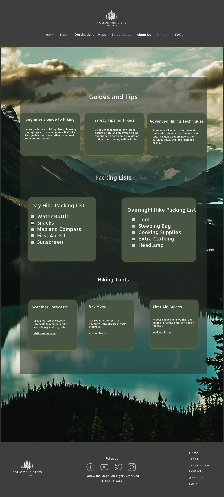

# Follow the Steps

"Follow the Steps" is a website dedicated to providing detailed information about various hiking trails, destinations, and maps in Trondheim City in Norway. It serves as a comprehensive travel guide for outdoor enthusiasts.

## Features

- **Hiking Trails**: Detailed descriptions and maps of various hiking trails.
- **Destinations**: In-depth guides to new places.
- **Travel Guide**: Tips and advice for hiking adventures.
- **Contact Us**: Information and inquiries.
- **About Us**: Mission and Our values.

## Map Integration

The website uses the OpenStreetMap API to display interactive maps. These maps showcase trail locations with markers and provide interactivity for a better user experience.

## JavaScript Forms

This website utilizes JavaScript for handling form submissions, ensuring seamless user interaction and data processing.

## How to Use

1. Navigate through the different sections using the menu.
2. Select a trail or destination to view detailed information.
3. Use the contact form for any inquiries or suggestions.
4. Book a Tour.

## Figma Design

You can view the Figma design for this project [here](https://www.figma.com/design/eTzSjfsQKaUxmdkTmi8HpY/Follow-the-Steps(Hiking-Trails)?node-id=11-165&t=VLWWo31M4cH4fpx7-1).

Here are some screenshots of the Figma design:

### Home Page

### Trail Information Page

This project is created as a portfolio project to integrate and practice HTML, CSS, and JavaScript.

